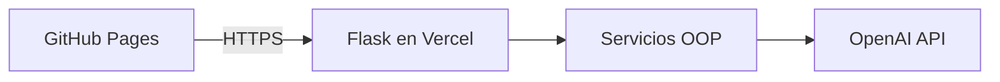

# Traductor Inteligente Multimodal Español ↔ Inglés

Aplicación web de Inteligencia Artificial que traduce texto, conversaciones, audio, documentos e imágenes entre español e inglés. El frontend responsivo se publica en GitHub Pages y el backend Python en Vercel.

## Problema que resuelve

Una organización con personal de México y Estados Unidos necesita reducir las barreras de idioma en mensajes, grabaciones, documentos y fotografías. Esta solución integra las cuatro modalidades en una sola interfaz y conserva claramente el contenido original y su traducción.

## Funcionalidades

- Traducción bidireccional de texto.
- Chat bilingüe con historial durante la sesión.
- Transcripción, traducción y voz traducida de audios.
- Extracción y traducción de PDF, DOCX y TXT.
- Lectura de texto visible y traducción de JPG, PNG y WEBP.
- Estados de carga, validaciones y errores comprensibles.
- Diseño Bootstrap adaptable a computadora, tableta y teléfono.
- Aviso de privacidad y manejo temporal de archivos.

## Arquitectura



La credencial únicamente existe como variable de entorno del backend. El JavaScript público nunca conoce la API key.

## Programación Orientada a Objetos

El proyecto demuestra:

- **Abstracción:** `BaseProcessor` define el contrato común `process()`.
- **Herencia:** los procesadores de audio, documentos e imágenes heredan de `BaseFileProcessor`.
- **Encapsulamiento:** clientes, modelos y validadores se conservan como atributos internos.
- **Composición:** `ChatService`, `AudioService` y `DocumentService` reutilizan un objeto `TextTranslator`.
- **Polimorfismo:** cada servicio implementa `process()` de acuerdo con su modalidad.
- **Inyección de dependencias:** `ApplicationContainer` crea y conecta objetos reutilizables.

Consulta [docs/OOP.md](docs/OOP.md) para el diagrama de clases.

## Tecnologías

- HTML5, CSS3 y JavaScript.
- Bootstrap 5 y Bootstrap Icons.
- Python y Flask.
- OpenAI Responses API, transcripción y Text-to-Speech.
- PyPDF, python-docx y Pillow.
- Git, GitHub Pages y Vercel.

## Formatos y límites

| Modalidad | Formatos | Límite |
|---|---|---:|
| Audio | MP3, WAV, M4A, WEBM | 3.8 MB |
| Documento | PDF, DOCX, TXT | 3.8 MB y 30,000 caracteres |
| Imagen | JPG, JPEG, PNG, WEBP | 3.8 MB |
| Texto | Texto escrito | 10,000 caracteres en la interfaz |

El límite de archivos se mantiene debajo del máximo de cuerpo de una función de Vercel.

## Instalación local

1. Abre una terminal dentro de `backend`.
2. Crea el entorno virtual:

```bash
python -m venv .venv
```

3. Actívalo en macOS/Linux:

```bash
source .venv/bin/activate
```

En Windows:

```powershell
.venv\Scripts\activate
```

4. Instala las dependencias:

```bash
pip install -r requirements.txt
```

5. Copia `.env.example` como `.env` y agrega tu API key real.
6. Inicia el backend:

```bash
python api/index.py
```

7. Desde la raíz del proyecto inicia el frontend:

```bash
python -m http.server 5500
```

8. Visita `http://localhost:5500`.

## Variables de entorno

```env
OPENAI_API_KEY=your_openai_api_key_here
FRONTEND_ORIGINS=http://localhost:5500,http://127.0.0.1:5500,https://TU-USUARIO.github.io
OPENAI_TEXT_MODEL=gpt-5.6-luna
OPENAI_TRANSCRIBE_MODEL=gpt-transcribe
OPENAI_TTS_MODEL=gpt-4o-mini-tts
OPENAI_TTS_VOICE=marin
```

Nunca subas `.env` a GitHub.

## Despliegue

### Backend en Vercel

1. Sube el repositorio a GitHub.
2. Importa el repositorio en Vercel.
3. Configura `backend` como Root Directory.
4. Registra todas las variables de entorno.
5. Despliega y prueba `https://TU-BACKEND.vercel.app/api/health`.

### Frontend en GitHub Pages

1. Cambia la meta `api-base-url` de `index.html` por la URL real de Vercel.
2. Cambia `TU-USUARIO` en `FRONTEND_ORIGINS` por tu usuario de GitHub.
3. En GitHub abre Settings → Pages.
4. Publica desde la rama `main` y la carpeta raíz.

## Seguridad y privacidad

- La API key permanece únicamente en Vercel.
- CORS y una comprobación del encabezado `Origin` restringen navegadores permitidos.
- El frontend y backend validan extensión y tamaño.
- El backend también valida MIME, contenido y formatos.
- Los errores no exponen trazas ni credenciales.
- Las respuestas de OpenAI se solicitan con `store=False`.
- Los archivos se procesan en memoria y no se guardan permanentemente.

CORS no protege completamente un endpoint público contra abuso. Para producción real también deben implementarse autenticación, límites de gasto y rate limiting persistente.

## Limitaciones conocidas

- Los PDF escaneados sin texto seleccionable deben procesarse como imágenes.
- La exactitud depende de la calidad del audio o de la fotografía.
- Los documentos traducidos se muestran en pantalla; no se reconstruye la maquetación original.
- Vercel y OpenAI pueden imponer límites de tiempo, tamaño, disponibilidad y costo.
- El historial del chat se guarda solamente en `sessionStorage` durante la sesión.

## Autor

José Alonso Godínez Franco

## URLs de entrega

- Aplicación: https://l24200197-commits.github.io/1.4-Examen-Tema-1.-Tendencias-actuales-de-la-IA/
- Repositorio: https://github.com/l24200197-commits/1.4-Examen-Tema-1.-Tendencias-actuales-de-la-IA
- Backend: https://backend-ecru-eight-15.vercel.app/api/health

