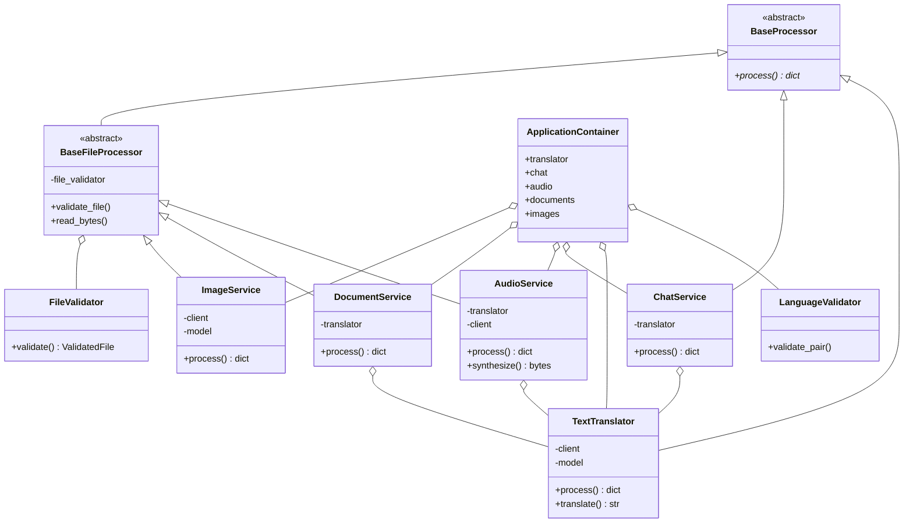

# Diseño orientado a objetos

## Responsabilidades

| Clase | Responsabilidad |
|---|---|
| `BaseProcessor` | Establecer el contrato polimórfico de procesamiento. |
| `BaseFileProcessor` | Reutilizar validación y lectura segura de archivos. |
| `TextTranslator` | Encapsular prompts y llamadas de traducción. |
| `ChatService` | Construir contexto conversacional temporal. |
| `AudioService` | Transcribir, traducir y sintetizar audio. |
| `DocumentService` | Extraer, dividir y traducir documentos. |
| `ImageService` | Validar imágenes, reconocer texto y traducirlo. |
| `FileValidator` | Validar extensión, MIME, tamaño y archivo vacío. |
| `LanguageValidator` | Validar el par español-inglés. |
| `ApplicationContainer` | Crear objetos e inyectar dependencias compartidas. |

